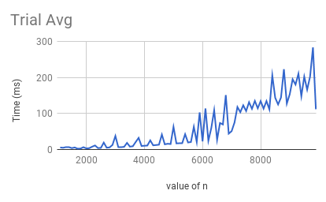

# Team-Trash
Woosuk Lee, Ryan Kim, Adrian Kloskowski
APCS Pd. 8

## Matrix Search Algorithm
1. Start from the upper right corner of the 2D matrix.
2. If the target number is greater than the current position, move down the column.
3. If the target number is less than the current position, move left the row.
4. If the target number is the same, end the program.

# Hypothesis
Our original hypothesis for this lab was that the MatrixFinder algorithm will run in linear time.

# Background
Initially, team251 (aka the Coffee Converters) was on a mission to find a search algorithm for a 2D array (with all rows and columns increasing order) with a linear runtime. After finding the algorithm, we were given this task to actually compute how the runtime changes as n becomes greater.

# Experiment Methodology
To perform this lab, we made a forloop that will iterate as the value of n increments by 100 up to a certain value (~100 iterations). At the top of the loop, we saved the currentTimeMillis() in a variable, and after performing the algorithm, we saved currentTimeMillis() in another variable and saved the difference of those two variables in another variable (which we printed out).

# Results
The results was rather astonishing. Rather than showing a linear graph, the runtime was showing an "up-and-down" pattern. The overall trend, however, was increasing. Moreover, there were some peculiar and random peaks in some of trials which contributed to the up-and-down pattern.

Graph for the 5 Trials:

Graph for the Avg of the trials:

# Conclusion
The general data does not show an exact linear graph and there were a lot of "ups and downs". We believe that there would have been some factors within the hardware of the actual machine that could have contribute to these variables. However, the overall trend seems show a linear pattern. Therefore, our hypothesis is correct and the code runs in linear time O(n).
