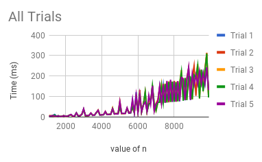

# Team-Trash
## Matrix Search Algorithm
Woosuk Lee, Ryan Kim, Adrian Kloskowski
APCS Pd. 8

# Hypothesis
Our original hypothesis for this lab was that the MatrixFinder algorithm will run in linear time.

# Background
Initially, team251 (aka the Coffee Converters) was on a mission to find a search algorithm for a 2D array (with all rows and columns increasing order) with a linear runtime. After finding the algorithm, we were given this task to actually compute how the runtime changes as n becomes greater.

# Experiment Methodology
To perform this lab, we made a forloop that will iterate as the value of n increments by 100 up to a certain value (~100 iterations). At the top of the loop, we saved the currentTimeMillis() in a variable, and after performing the algorithm, we saved currentTimeMillis() in another variable and saved the difference of those two variables in another variable (which we printed out).

# Results
The results was rather astonishing. Rather than showing a linear graph, the runtime was showing an "up-and-down" pattern. The overall trend, however, was increasing.

Graph for the 5 Trials:

Graph for the Avg of the trials:

